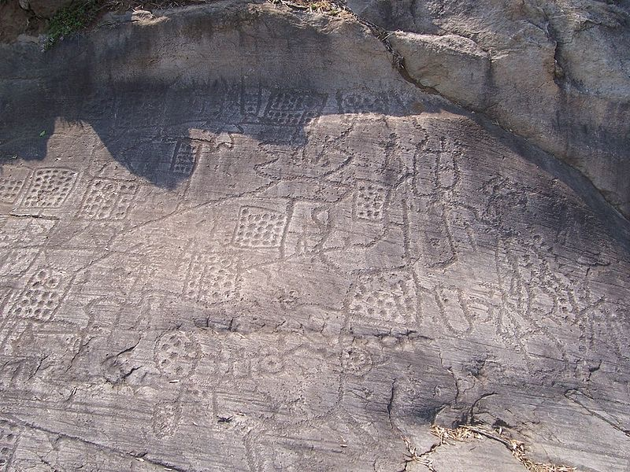
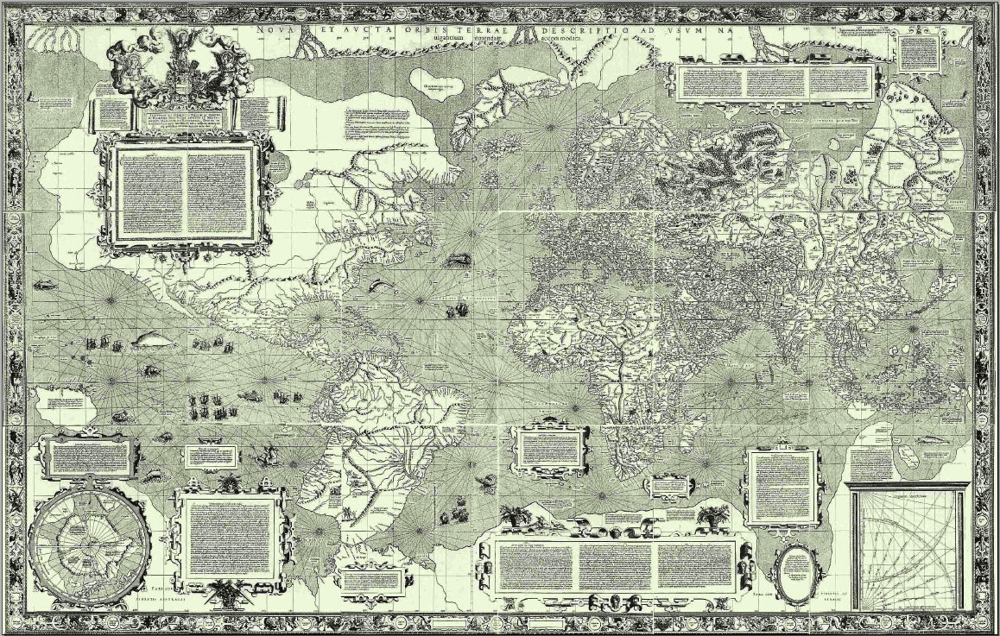
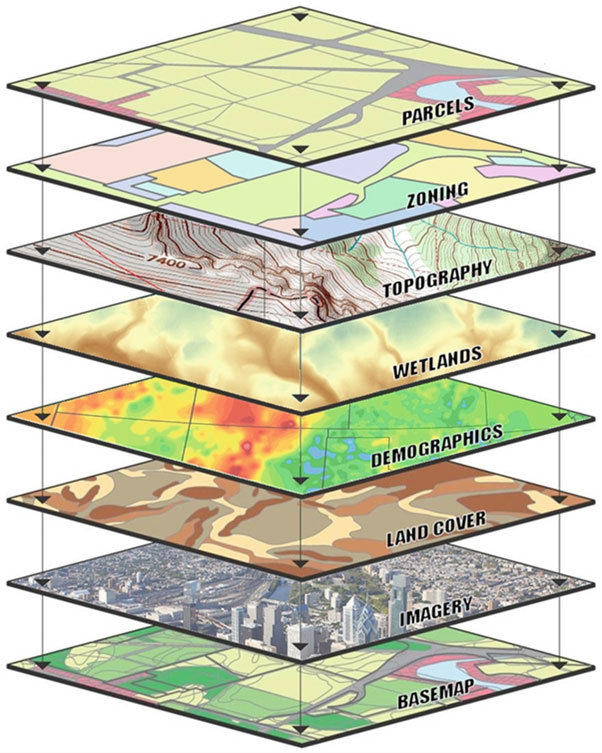
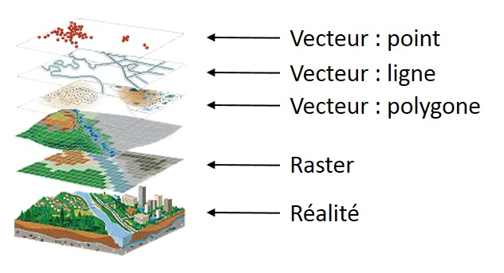

```{r setup, include=FALSE}
library(xaringanthemer)
library(flair)
options(htmltools.dir.version = FALSE)
style_extra_css(
  css = list(
    ".remark-slide-content" = list("padding-left" = "80px", "padding-right" = "80px"),
    ".remark-code" = list("background" = "#dedede !important", "white-space" = "pre-wrap !important"),
    ".remark-code-line" = list("color" = "#00496f"),
    ".remark-inline-code" = list("background" = "#dedede !important"),
    ".pull-left" = list("float" = "left", "width" = "47%"),
    ".pull-right" = list("float" = "right", "width" = "47%"),
    ".pull-left-large" = list("float" = "left", "width" = "63%"),
    ".pull-right-large" = list("float" = "right", "width" = "63%"),
    ".pull-left-small" = list("float" = "left", "width" = "30%"),
    ".pull-right-small" = list("float" = "right", "width" = "30%"),
    ".bordered" = list("display" = "inline-block", "border" = "1px solid black"),
    ".flair-pink code" = list("background-color" = "#ad8cae !important"),
    ".flair-blue code" = list("background-color" = "#4f93b8 !important"),
    ".flair-green code" = list("background-color" = "#2e9093 !important"),
    ".flair-orange code" = list("background-color" = "#ee950b !important"),
    ".flair-red code" = list("background-color" = "#dd4123 !important"),
    ".boldcenter" = list(
      "display" = "block",
      "font-size" = "28px !important",
      "font-weight" = "bold",
      "margin-top" = "80px",
      "text-align" = "center"
    ),
    ".boldcenter a" = list(
      "font-size" = "28px !important"
    )
  ),
  outfile = "personal.css",
  append = FALSE,
  heading = "Extra CSS"
)
```

# Cartographie

## Introduction

.pull-left-large[La cartographie consiste à représenter un espace (généralement réel) sous une forme graphique simplifiée.

Historiquement les plus vieilles cartes dont on garde une trace sont des *pétroglyphes* comme ceux de Bedolina en Italie (voir ci-contre).

Au cours de la préhistoire, les civilsations greco-romaines font de la cartographie une discipline à part entière. Des savants tels qu'Eratosthène et Ptolémée perfectionnent les techniques et mettent en place des concepts tels que les *systèmes de coordonées* ou les *projections*.]

.pull-right-small[
```{r, echo=FALSE}

```
]

---

# Cartographie

## Introduction

.pull-left[Au fil des siècles, les cartes réalisées à l'époque de Ptolémée sont reprises et parfois augmentées.

Le développement de la cartographie est souvent étroitement lié avec les volontées de conquête et d'exploration. Les progrès, notament dans le domaine de la navigation permettent également d'étendre les frontières du monde connue et d'améliorer les cartes existante.

Au 16e Siècle, des cartographes comme *Gerardus Mercator* et *Abraham Ortelius* donne un nouvel élan à la discipline. L'invention d'une projection *conforme* par *Mercator* améliore considérablement la navigation. En effet, un cape précis équivaut à une ligne droite sur ce type de cartes.]

.pull-right[
```{r, echo=FALSE}

```
]

---

# Cartographie informatique

## Les *systèmes d'information géographique*

.pull-left-large[Avec l'apparition des outils numériques, la cartographie vit une nouvelle révolution: l'apparition des *systèmes d'information géographique* ou *SIG* (*GIS* en anglais). La cartographie devient numérique et offre des possibilités de recueil, de traitement et d'analyse qui était jusqu'à présent inimaginable.

Différentes couches de données peuvent être superposées, analysées, voir combinées pour obtenir des informations ou des cartes de synthèse. Ces couches peuvent contenir des données de nature très variée (données satellites, hydrographie, topographie, routes, constructions, zones d'amménagement, informations statistiques, …).]

.pull-right-small[
```{r, echo=FALSE}

```
]

---

# Cartographie informatique

## Types de données

.pull-left-small[
Les données numérique de cartographie se divise en deux types :

- les données *vectorielles*
- les données *raster*

Les données vecteurs peuvent être subdivisée en trois types :

- point
- ligne
- polygone
]

.pull-right-large[
```{r, echo=FALSE}

```
]

---

# Cartographie informatique

## Exercices

Lien vers le portail pour les exercices :

.boldcenter[
[https://geoviews.link/PyCartoProj](https://geoviews.link/PyCartoProj)
]

---

# Cartographie informatique

## Lire des données raster

Nous aurons besoin des modules suivants :

```{python}
import matplotlib.pyplot as plt # Pour afficher les données raster
from matplotlib import cm # Pour la palette de couleur
from osgeo import gdal # Pour lire les données raster
```

Pour lire des données raster on aura recours à la fonction `Open` de `gdal` :

```{python}
DEM = gdal.Open("geodata/Neuchatel.tif")
DEM_Array = DEM.GetRasterBand(1).ReadAsArray()
DEM_Array.ndim
```

DEM_Array est une matrice avec 2 dimensions: un *rectangle* de données avec les dimensions suivantes:

```{python}
DEM_Array.shape
```

---

# Cartographie informatique

## Lire des données raster – exercice

Explorez la matrice `DEM_Array`. Vous pouvez accéder à des morceaux de la matrice de la façon suivant:

```{python, results=FALSE}
DEM_Array[50] # Donne toutes les données le long de la 51ème ligne
DEM_Array[120,120] # Donne la données de la 121ème ligne et de la 121ème colonne
DEM_Array[120,120:130] # Donne les données de la 121ème ligne, allant de la 121ème à la 130ème colonne
```

En sachant qu'il s'agit de données raster du canton de Neuchâtel. Quelle données pourrait-on avoir *encodé* dans cette matrice ?

--

```{python}
DEM_Array[50,120:130]
```

Comme nous le montre ce petit *extrait* de la matrice, il s'agit très certainement de l'**altitude**.

---

# Cartographie informatique

## Afficher des données raster – exercice

.pull-left[
En quelque lignes on peut se rendre compte de ce que donne cette matrice.

```{python neuch-elev, results=FALSE, fig.show='hide'}
plt.imshow(DEM_Array, cmap=cm.gist_earth) # On affiche la matrice sous forme d'image, cmap = palette de couleur à utiliser
plt.axis('off') # On désactive les coordonées autour de la carte

cbar = plt.colorbar(shrink=0.5) # On récupère la barre de couleur (en la réduisant à 50% de sa taille originale)
cbar.set_label('mètres') # et on rajoute le Label `mètres` 

plt.show() # Et on affiche la figure 
```

Essayez !
]

--

.pull-right[
```{r, echo=FALSE}
knitr::include_graphics(
  knitr::fig_chunk("neuch-elev", "png")
)
```
]

---

# Cartographie informatique

## Lire des données vecteur

Nous aurons besoin des modules suivants :

```{python}
import pandas as pd # pandas permet de manipuler des tableaux de données
import geopandas as gpd # geopandas `étend` panda pour permettre des colonnes `vecteur`
import matplotlib.pyplot as plt # Pour afficher des données
from matplotlib.colors import TwoSlopeNorm # Pour la palette de couleur
```

Pour lire des données vecteur on aura recours à la fonction `read_file` de `geopandas` :

```{python}
cantons = gpd.read_file('geodata/Cantons.shp')
```

---

# Cartographie informatique

## Lire des données vecteur – exercice

Explorez la tableau de données `cantons`. Vous pouvez afficher les colonnes de la manière suivantes :

```{python, results=FALSE}
cantons.columns # Affiche le nom de toutes les colonnes du tableau `cantons`
cantons['KTNAME'] # Affiche le contenu de la colonne `KTNAME`
```

Quelle colonne contient les informations géographiques ? Comment sont-elles représentées ?

--

```{python}
cantons['geometry'].head(5)
```

---

# Cartographie informatique

## Lire des données statistiques – exercice

Pandas permet de lire des données statistiques (sous forme de fichier *csv*, *excel* ou autre tableau de données) :

```{python}
pop = pd.read_csv('statdata/swiss_pop_2021.csv')
nat = pd.read_csv('statdata/swiss_nat_2021.csv')
```


En utilisant les mêmes fonctions que pour le tableau `cantons`, explorer les tableaux `pop` et `nat`. Que contiennent-ils ?

--

Les chiffres de la **population** et des **taux de natalité** par cantons suisses.

---

# Cartographie informatique

## Combiner des tableaux de données

*Pandas/GeoPandas* permet de facilement combiner des tableaux de données lorsqu'on possède une colonne qui identifie de la même manière les données de deux tableaux différents.

Le code ci-dessous combine le tableau `cantons` (avec sa colonne *identifiant* `KTNR`) avec le tableau `nat` et sa colonne `ID` :

```{python}
cantons_nat = cantons.set_index('KTNR').join(nat.set_index('ID'))
cantons_nat.head(3)
```

La fonction `set_index()` indique la colonne à utiliser comme *clé* d'identification.

---

# Cartographie informatique

## Combiner des tableaux de données – exercice

Trouvez un moyen de combiner le tableau `cantons` avec les données du tableau `pop` **et** les données du tableau `nat`.

--

Indice : la colonne `Canton` dans les deux tableaux `pop` et `nat` pose problème lorsqu'on essaye de joindre le deuxième tableau. La fonction `drop(columns = 'NomDeColonne')` permet de retirer une colonne d'un tableau.

--

```{python}
cantons_pop_nat = cantons.set_index('KTNR').join(pop.set_index('ID')).join(nat.set_index('ID').drop(columns = 'Canton'))
cantons_pop_nat.columns
```

---

# Cartographie informatique

## Combiner des tableaux de données – exercice

Il est relativement simple de manipuler des tableaux de données. Si on veut par exemple créer une colonne `TxNat` qui contient le taux de natalité (en pour mille), on peut procéder de la sorte :

```{python}
cantons_pop_nat['TxNat'] = cantons_pop_nat['Naissances']/cantons_pop_nat['Population']*1000
cantons_pop_nat['TxNat'].head(3)
```

Créez les colonnes `TxNat` avec le *taux de natalité* (comme ci-dessus), ainsi qu'une colonne `RapFG` avec le rapport des sexes (nombre de naissances *garçons* pour 100 naissances *filles*).

---

# Cartographie informatique

## Combiner des tableaux de données – exercice

```{python}
cantons_pop_nat['RapFG'] = cantons_pop_nat['Garçons']/cantons_pop_nat['Filles']*100
cantons_pop_nat['RapFG'].head(10)
```

---

# Cartographie informatique

## Afficher des données vecteur

.pull-left[
On peut très facilement afficher la carte d'un tableau de données géographiques.

```{python map-swiss-no-data, fig.show='hide'}
cantons_pop_nat.plot()
```
]

.pull-right[
```{r, echo=FALSE}
knitr::include_graphics(
  knitr::fig_chunk("map-swiss-no-data", "png")
)
```
]

---

# Cartographie informatique

## Afficher des données vecteur

.pull-left[
En spécifiant un argument `column='TxNat'` par exemple, on peut afficher les données d'une colonne sur la carte.

```{python map-swiss-cbr, fig.show='hide'}
cantons_pop_nat.plot(column='TxNat', legend=True)
```
]

.pull-right[
```{r, echo=FALSE}
knitr::include_graphics(
  knitr::fig_chunk("map-swiss-cbr", "png")
)
```
]

---

# Cartographie informatique

## Afficher des données vecteur – exercice

Faites une carte avec le rapport de naissances filles/garçons. Quel problème pouvez-vous constater ?

--

.pull-left[
```{python map-swiss-sxrt, fig.show='hide'}
cantons_pop_nat.plot(column='RapFG', legend=True)
```
]

.pull-right[
```{r, echo=FALSE}
knitr::include_graphics(
  knitr::fig_chunk("map-swiss-sxrt", "png")
)
```
]

---

# Cartographie informatique

## Afficher des données vecteur – exercice

--

.pull-left[
```{python map-swiss-sxrt-2, fig.show='hide', results=FALSE}
vmin, vmax, vcenter = cantons_pop_nat['RapFG'].min(), cantons_pop_nat['RapFG'].max(), 100
norm = TwoSlopeNorm(vmin=vmin, vcenter=vcenter, vmax=vmax)

cmap = 'RdBu'
cbar = plt.cm.ScalarMappable(norm=norm, cmap=cmap)

cantons_pop_nat.plot(column='RapFG', cmap=cmap, legend=False)

plt.colorbar(cbar, orientation = 'horizontal')
plt.axis('off')
plt.show()
```
]

.pull-right[
```{r, echo=FALSE}
knitr::include_graphics(
  knitr::fig_chunk("map-swiss-sxrt-2", "png")
)
```
]

---

# Cartographie informatique

## Projet – travaux de groupes

Explorez les données qui se trouvent dans le dossier *statdata*. À partir de ces données :

- réalisez une carte – éventuellement en combinant plusieurs indicateurs ;
- analysez la carte que vous obtenez ;
- préparez une brève présentation de votre carte et de ce qu'elle montre (~5 minutes).
